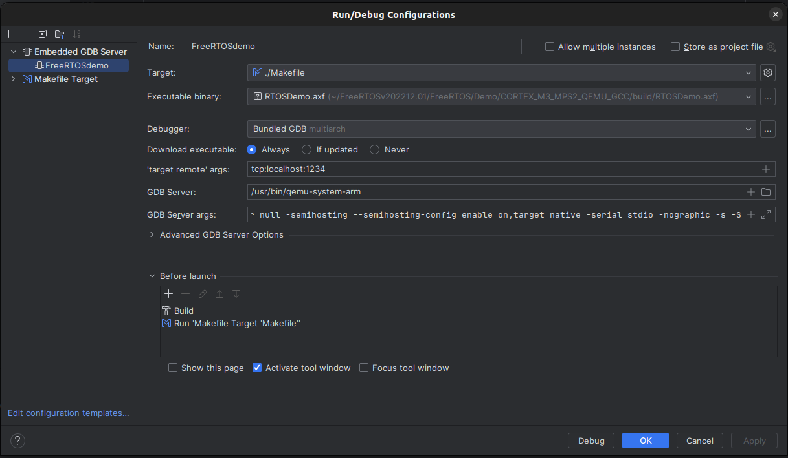

# Introduction

This repository aims to demonstrate the functionality of the **FreeRTOS** kernel, with a specific emphasis on utilizing the Task Management API and Queue Management API while enabling the support for **Real Time Scheduling** by implementing a new library called **RealTimeScheduler**.

#### :pushpin: List of Features provided:

- Support for **Static** and **Dynamic** Priority Scheduling 
    - **Rate Monotonic Scheduling (RMS)** 
    - **Earliest Deadline First (EDF)**

- Support for **Periodic Tasks**
- Support for **Aperiodic Tasks**
    - **Polling Server** with flexible Budget Size
- Support for **Feasibility Test** under RMS and EDF scheduling algorithms
    - **Worst Case Response Time (WCRT)** Necessary Test supported
- Default **Fixed** Priority Scheduling 
- Support for Task's **Execution Time Statistics** (TickHook)

All the tests and statistics are conducted using **QEMU** emulated hardware. The hardware emulated is the AN385 platform on the **MPS2** board (**Cortex-M3** based SoC).

Further details regarding the library APIs are provided below.

# Getting Started

The following instructions are provided for an Ubuntu/Debian Linux distribution.
## Installing QEMU

First of all, let’s download and install QEMU on our system:

    $ sudo apt update && upgrade
    $ sudo apt install qemu - system

Then, let’s download and unzip the FreeRTOS Kernel and the demo project bundled with it:

    $ git clone https://github.com/FreeRTOS/FreeRTOS.git --recurse -submodules --depth 1

    
The previous command should create a directory named **FreeRTOS**.\
Many of the files in this folder are unnecessary for our needs. Feel free to delete any subfolder dedicated to other platforms than the QEMU ARM Cortex-M3 used in this repository (i.e. the CORTEX_M3_MPS2_QEMU_GCC folder).

Since we're operating on a 64-bit Intel architecture, we'll require a cross-compiling toolchain to get ARM binaries from our C code. The GNU Arm Embedded Toolchain targets the 32-bit Arm Cortex-M processor family and includes the GNU Compiler (GCC) and Debugger (GDB).   

    $ sudo apt-get remove binutils-arm-none-eabi gcc-arm-none-eabi
    $ sudo add-apt-repository ppa:team-gcc-arm-embedded/ppa
    $ sudo apt-get update
    $ sudo apt-get install gcc-arm-none-eabi
    $ sudo apt-get install gdb-arm-none-eabi

Let’s configure the GNU debugger to work with ARM architectures:

    $ gdb multiarch

    (gdb) set architecture arm
    (gdb) quit

## QEMU and debugger use from CLI

Although we'll primarily utilize an IDE to issue commands to the debugger, here is an explation on how to use the GDB debbuger in a command-line interface (CLI).\
Navigate to the folder of our binaries and compile them for debugging mode (debugging symbols and no optimizations):

    $ cd <path_to_CORTEX_M3_MPS2_QEMU_GCC_folder>
    $ make DEBUG=1

:bell: **Note**: For a release build run:

    $ make
If the build has completed successfully, now we have a "build" folder, containing the RTOSDemo.axf file.

Now we run FreeRTOS with QEMU:

    $ sudo qemu-system-arm -machine mps2-an385 -monitor null -semihosting \ --semihosting-config enable=on, target=native \ -kernel ./build/RTOSDemo.axf \ -serial stdio -nographic -s -S

- The `-s` option makes QEMU listen for an incoming connection on TCP port 1234; this is the port the GDB debugger will use.

- The `-S` option starts the debugger in the paused state, because we need to wait for the incoming gdb connection.

- The `-serial stdio -nographic` option redirects QEMU's output to the terminal we're using instead of a separate graphical window.

Once you're done, open another terminal and run the debugger on the RTOSDemo executable:

    $ gdb-multiarch -q ./build/RTOSDemo.axf

Then set as target our machine on 1234/TCP port:

    (gdb) target remote localhost:1234

At this point, we can set breakpoints for whatever function we want and move to the next lines with *continue* command:

    (gdb) break main
    (gdb) c

## Setting up CLion

CLion has been chosen for this project because it offers support for FreeRTOS integration. Within CLion is possible to run an embedded GDB server too. 

First, let's open CLion and open our `Demo` folder as a new project. 
At the top right corner of the window, click on `Add Configuration` to open the settings for running and debugging. Then, click `Add new...` and `Makefile target`. 

Fill in the following parameters:

    Name: Makefile
    Makefile: the PATH of the Makefile
    Arguments: DEBUG=1

You can find the Makefile in the following PATH `…/FreeRTOS/Demo/CORTEX_M3_MPS2_QEMU_GCC/Makefile`.

Now click `Apply` and then `OK`.

It's time to compile: by pressing the `RUN` button (the small green triangle) the IDE will automatically run the command

    $ make DEBUG=1

inside our folder in which the binaries are located. If everything went well, now we should see a folder named `Build` in the root folder of our `Demo`. Inside that, we'll find our RTOSDemo.axf file.

`".axf"` is the extension for ARM Executable Images. It contains the machine code.

We will now configure an Embedded GDB Server that will do exactly the same things we did inside our Linux terminal before. First, start by opening the `Edit` menu and select `Edit Configurations...`. Now, click the `+` button and select `Embedded GDB Server`. The fields to be filled are shown in the following picture:

For the Target field, click the Settings icon, then Add target, and Make. Fill the parameters with the configuration shown in the figure above.   

For the GDB server args field, insert: 

    -machine mps2-an385 -monitor null -semihosting --semihosting-config enable=on,target=native -serial stdio -nographic -s -S

In the Before launch sub-pane, click on the `+` icon, then choose `Run another configuration`and select the Makefile.

Make sure that as 'Debugger' you have, next to 'Bundled GDB', `the word multiarch in grey`. If not, select the path of the GDB we have installed previously. If you need help locating it, run the following command in a terminal:

    $ which gdb-multiarch

(default location is `/usr/bin/gdb-multiarch`).

Default path for us will be `/usr/bin/qemu-system-arm`, because that's the program that will allow us to connect our Demo to the debugger.

We're done here. Click `Apply` and then `OK` to return to our code. From now on, every time we will start a debug session from CLion, the IDE will re-compile our binaries using the target Makefile, and run the latest version of the RTSDemofile.axf.

CLion supports the Objects View and Heap View for debugging with FreeRTOS. 
In CLion, click

`File -> Settings... -> Embedded Development -> RTOS Integration`

Set the `Enable RTOS Integration` checkbox and choose 
`FreeRTOS` from the list of options.

Now we are finally ready to start delving into any line of code using the debugger. Before doing so, make sure to close all other QEMU instances that you might have started before, the following command should do the trick:

    $ killall qemu-system-arm

# FreeRTOS Demo 

Apart from the binaries required for FreeRTOS standard libraries, the code of the project is located in the folder PATH `FreeRTOS/Demo/CORTEX_M3_MPS2_QEMU_GCC`. The target files of the project are:

- FreeRTOSConfig.h
- Makefile
- main.c
- ListIP.c /.h
- client.c /.h
- server.c /.h
- RealTimeScheduler.c /.h

Thanks to the use of C directives, it's possible to run different demos (located in `main.c`) for demonstration purposes. It is possible to enable them one time each by uncommenting the `CFLAGS` within the `Makefile`. 

    CFLAGS := -DmainASSIGN_IP_DEMO=1

    #CFLAGS := -DmainROUND_ROBIN_DEMO=1
    #CFLAGS := -DmainFIXED_PRIORITY_NOPREEMPTION_DEMO=1
    #CFLAGS := -DmainFIXED_PRIORITY_PREEMPTION_DEMO=1
    #CFLAGS := -DmainRM_NOAPERIODIC_DEMO=1
    #CFLAGS := -DmainEDF_NOAPERIODIC_DEMO=1
    #CFLAGS := -DmainRM_APERIODIC_DEMO=1
    #CFLAGS := -Dmain_RM_DIFF_ARRIVAL_DEMO=1
    #CFLAGS := -DmainRM_WCRT_DEMO=1
    #CFLAGS := -DmainEDF_WCRT_DEMO=1

The first flag uncommented activates the IP assignation and Ping demo.

There are two important flags inside `FreeRTOSConfig.h` for enabling/disabling the preemption and the time slicing (Round Robin). 

    #define configUSE_PREEMPTION  1     // activated
    #define configUSE_TIME_SLICING  0   // deactivated

:bell: **Note**: For the Ip assignation and Ping demo only `configUSE_PREEMPTION` must be enabled.

# :bomb: RealTimeScheduler APIs
*RealTimeScheduler* library provides four important APIs:

- void **vInitScheduler()**;
- void **vPeriodicTaskCreate( *parameters* )**;
- void **vAperiodicTaskCreate( *parameters* )**;
- void **vTaskStartRealTimeScheduler()**;

:warning: **WARNING**: Before creating any tasks the Scheduler MUST be initialized:

    void vInitScheduler();

To create a Periodic Tasks the following function must be used with the following parameters:

    void vPeriodicTaskCreate(
        TaskFunction_t pxTaskCode,      // Code to Execute
        const char *pcName,             // Descriptive name for the Task 
        TaskHandle_t *pxTaskHandle,     // Task Handle 
        const uint32_t ulStackDepth,    // Size of the Task's Stack
        void *pvParameters,             // Optional arguments
        BaseType_t xPriority,           // Task's Static Priority
        TickType_t xArrivalTime,        // Arrival time of the task
        TickType_t xPeriod,             // Task's phase 
        TickType_t xDeadline,           // Task's Deadline 
        TickType_t xWCET                // Theoretical Worst Execution Time
    );

To create an Aeriodic Tasks the following function must be used with the following parameters:

    void vAperiodicTaskCreate( 
        TaskFunction_t pxTaskCode,      // Code to Execute
        const char *pcName,             // Descriptive name fore the Task
        void *pvParameters,             // Optional arguments
        TickType_t xWCET                // Theoretical Worst Execution Time
    );

:warning: **Warning**: To start the Library Scheduler the default `vTaskStartScheduler()` has been replaced with the following function:

    void vTaskStartRealTimeScheduler();

In order to enable the Scheduling algorithm preferred these flags are provided inside `RealTimeScheduler.h` library.

    #define configENABLE_EDF        1       //enabled
    #define configENABLE_RM         0       //disabled
    #define configENABLE_FIXED      0
    #define configENABLE_APERIODIC  0

 :bell: **NOTE**:
- To enable fixed priority, RMS **MUST** be enabled too
- To enable aperiodic tasks, RMS **MUST** be enabled too
- To enable EDF scheduler, all others **MUST** be disabled

The activation of Aperiodic Tasks is possible by enabling the **Polling Server**, which is a Periodic Task created directly within the library when `configENABLE_APERIODIC` is set to 1. To set its budget, the following parameter inside `RealTimeScheduler.h` should be modified:

    #define configMAX_BUDGET_PS pdMS_TO_TICKS( SIZE )

For running the various demos, all the instructions for modifying these parameters are provided within `main.c` file.

:warning: **WARNING**: By default, FreeRTOS defines a maximum value for priorities. Since the priority of each Periodic Task is established starting from that value, adjusting it, depending on the required number of Periodic Tasks, is necessary to prevent overlapping priorities during Task creation.

# Gantt charts and Statistics

All the statistics regarding the tasks behavior are printed on standard output during the execution. Especially:

- **Feasibility Test** result
- **WCRT** of each Task
- For every Task's execution:
    - **Start Tick Count**
    - **Last Wake Time**
    - **Task's name** and **priority**
    - **Real Execution Time** and comparison with WCET

Output example:

    --------*[IDLE]*--------
    -------------------------------------------------------------------------

    [START] Tick count 2000 - Task Client1 - LastWakeTime 2000 - Priority 9 
    [CLIENT] Client 1 pings: 64 Bytes
    [END] Execution time 54 (WCET: 100) - Task Client1

    -------------------------------------------------------------------------

All the results of the various demos are documented with Gantt charts in the `Tutorials/Pictures` folder.  

:bulb: In order to create your own charts you can follow the tutorial provided in the `Tutorials/Gantt_Charts_Tutorial.md` file.